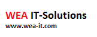

OXID Assets Management by WEA IT-Solutions
======



A very simple assets management module to load static files and images using a cdn.
### Module settings
Using the backend you can configure the url for the external cdn.

### Module installation via composer
In order to install this module using composer run the following command in your shop base directory where the shop's composer.json is placed.
```
composer require wea/assets-management
```
